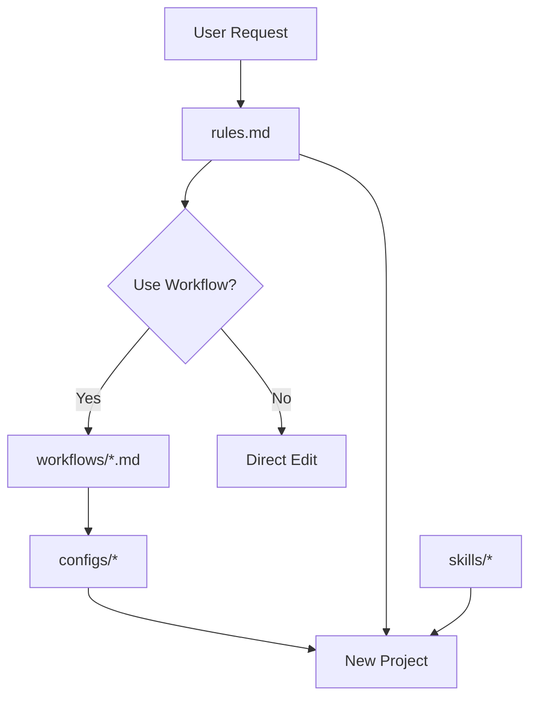

[⬅️ Back to Dashboard](../README.md)

# 🛠️ System Maintenance & Evolution Guide

This document is for the **Meta-Developer** (You). It explains how to Restore, Maintain, and Evolve the Antigravity Configuration itself.

---

## 🚨 Disaster Recovery (New Laptop)
If you lose your machine, follow these steps to restore your "Strict Guardian" environment:

1.  **Clone the Brain**:
    Open your terminal in your new `~/Developer` folder:
    ```bash
    mkdir -p ~/Developer
    cd ~/Developer
    git clone https://github.com/ASMHB/antigravity-config.git .agent
    ```

2.  **Verify**:
    Open `~/Developer` in Antigravity and ask: "What is my persona?".
    It should reply: "Strict Guardian".

3.  **Resume Work**:
    You can now use `new-project` or `maintain-project` workflows immediately.

---

## 🏗️ System Architecture
Understanding how the pieces fit together allows you to modify them safely.



1.  **Rules (`rules.md`)**: The Constitution. Defines *Behavior*.
2.  **Workflows (`workflows/`)**: The Machinery. Defines *Process*.
3.  **Configs (`configs/`)**: The Standards. Defines *Tooling*.
4.  **Skills (`skills/`)**: The Abilities. Defines *Ad-hoc Actions*.

---

## 🧬 Evolution: How to Change the System

### Scenario A: "I want to change a Rule"
*Example: You want to allow `any` in TypeScript (god forbid).*
1.  edit `.agent/rules.md`.
2.  Commit and Push: `git commit -m "docs: Relax TS rules" && git push`.
3.  **Impact**: Immediate for all future interactions in `~/Developer`.

### Scenario B: "I want to change the Linter Config"
*Example: You want to disable a specific ESLint rule.*
1.  Edit `.agent/configs/.eslintrc.base.js`.
2.  Commit and Push.
3.  **Impact**:
    *   **New Projects**: Will get the new config automatically.
    *   **Existing Projects**: You must run the `maintain-project` workflow in them to pull the update.

### Scenario C: "I want to support a New Language" (e.g., Rust)
1.  **Rules**: Add a "Rust" section to `rules.md` (Define Cargo, Clippy, etc.).
2.  **Configs**: Add `rustfmt.toml` to `.agent/configs/`.
3.  **Workflow**:
    *   Edit `.agent/workflows/new-project.md`.
    *   Add condition: `* If Rust: Run cargo new, copy rustfmt.toml`.
    *   Commit and Push.

---

## 🔄 Syncing Changes
When you update the configuration in `~/Developer/.agent` and push it, your standalone projects (ejected ones) **do not automatically update**.

To update a specific project:
1.  Open that project.
2.  Run: `git pull origin main` inside the `.agent` folder (if you kept the git history).
3.  OR: Just re-run the `maintain-project` workflow to overwrite configs with the latest Golden Masters.
