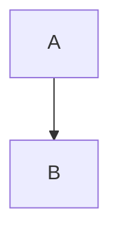

# Technical Specification

**Title**: [Project/Feature Name]
**Status**: [Draft | Approved]
**Author**: [Name]

## 1. Architecture Overview
*High-level design. Insert Mermaid diagram here.*

## 2. Data Model
*Schema definitions, Database changes.*

## 3. API Design
*Endpoints, Inputs, Outputs, Error Codes.*

## 4. Implementation Plan
*Step-by-step breakdown of tasks.*
1.  [ ] Setup ...
2.  [ ] Implement Core ...

## 5. Security & Privacy
*Auth, Data protection, etc.*
